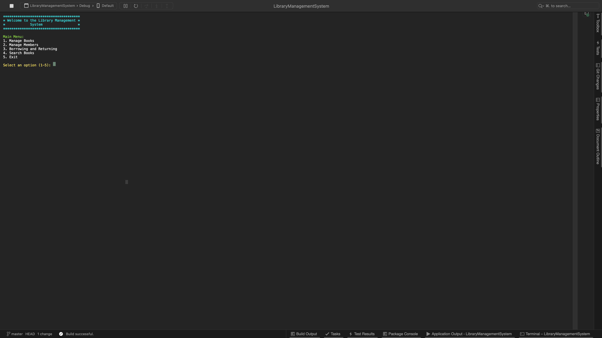

Library Management System (LMS)
===============================

Overview
--------

The Library Management System (LMS) is a comprehensive solution designed to manage book collections, member registrations, and book borrowing/return processes in a library setting. This system is built with a console-based interface, leveraging C# for robust functionality and easy future expansion.

Features
--------

### Book Management

-   **Add Book**: Librarians can add new books to the library's collection.
-   **Edit Book**: Existing book details can be modified.
-   **Delete Book**: Books can be removed from the collection.
-   **View All Books**: Display a list of all books in the library.
-   **Search Books**: Search for books by title, author, or genre.

### Member Management

-   **Register Member**: New members can be registered in the system.
-   **Edit Member**: Update existing member details.
-   **Delete Member**: Remove members from the system.
-   **View All Members**: Display a list of all registered members.

### Borrowing and Returning

-   **Borrow Book**: Members can borrow books, specifying the borrowing duration.
-   **Return Book**: Process the return of borrowed books and calculate any overdue fines.
-   **View All Borrowed Books**: Display a list of all books currently borrowed.


Tools and Technologies
--------
- **C#**: Core programming language used for development.
- **xUnit**: Framework used for unit testing.
- **MVC Pattern**: Ensures separation of concerns within the application.
- **Repository Pattern**: Facilitates data access logic separation.
- **File System**: Used for data persistence.
- **GitHub Actions**: Implemented for Continuous Integration/Continuous Deployment (CI/CD).

### Preview of Using the App via Console 
- Click the image to watch the video

[](https://youtu.be/mtX6V1AE4pk)


Setup and Usage
---------------

### Prerequisites

-   .NET 7.0 SDK or later
-   Visual Studio or any C# compatible IDE

### Installation

1.  Clone the repository:

    ```bash
    git clone https://github.com/yourusername/LibraryManagementSystem.git
    ```

2.  Navigate to the project directory:

    ```bash
    cd LibraryManagementSystem
    ```

3.  Restore dependencies:

    ```bash
    dotnet restore
    ```

### Running the Application

Start the application using the .NET CLI:


```bash
dotnet run --project LibraryManagementSystem
```

### Running Tests

Execute all tests using the .NET CLI:

```bash
dotnet test
```

Future Enhancements
-------------------

### Web Interface

-   Develop a web-based UI for broader accessibility using ASP.NET Core.

### Enhanced Member Features

-   Implement membership tiers with different borrowing limits.

### Advanced Search and Filter

-   Enable advanced search features including book categories, tags, and publication year filters.

### Reporting and Analytics

-   Generate detailed reports on library usage, popular books, and member activity.
-   Integrate analytics to track borrowing trends and optimize inventory.

### Mobile App Integration

-   Develop a companion mobile application for members to search, borrow, and reserve books.

### Third-Party Integrations

-   Integrate with external book databases for automatic book detail fetching.
-   Implement barcode scanning for quick book entry and lending.

Contributing
------------

Contributions are welcome! Please fork the repository and create a pull request with your changes. Ensure all new code is covered by unit tests where applicable.

Contact
-------

For any questions or feedback, please contact [hello@freemanmadudili.com](mailto:hello@freemanmadudili.com).
